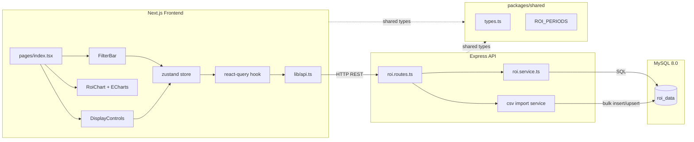
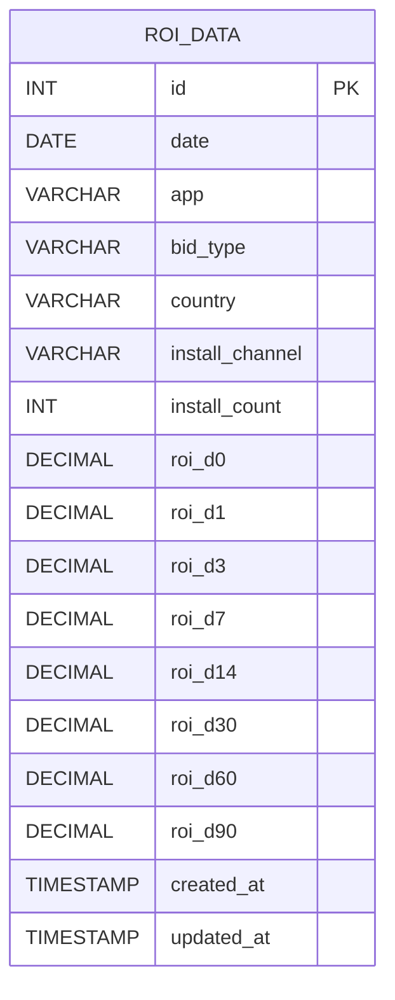
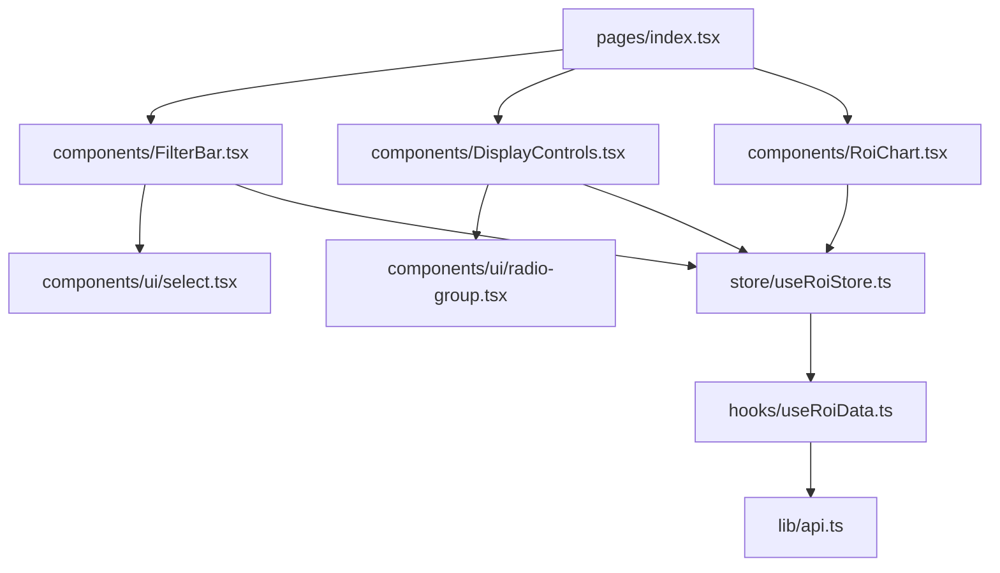

# 系统设计文档 (DESIGN.md)

本文档用于统一描述 App ROI Dashboard 的核心设计，覆盖系统架构、数据库设计、API 规范、前端组件结构与端到端数据流。

## 1. 系统整体架构图



### 技术栈

| 层级 | 技术 |
|---|---|
| 前端 | Next.js 16 (Pages Router), Tailwind CSS v4, zustand, @tanstack/react-query, echarts |
| 后端 | Express 5, csv-parser, mysql2 (pool), swagger-jsdoc, swagger-ui-express |
| 数据库 | MySQL 8.0 (Docker) |
| 共享包 | `@demo-of-app-roi/shared` (类型/常量) |
| 工程 | pnpm workspaces (monorepo) |

## 2. 数据库表结构设计和 ER 图

### 2.1 表结构: `roi_data`

| 字段 | 类型 | 约束 | 说明 |
|---|---|---|---|
| id | INT | PK, AUTO_INCREMENT | 主键 |
| date | DATE | NOT NULL | 数据日期 |
| app | VARCHAR(50) | NOT NULL | 应用名称 |
| bid_type | VARCHAR(20) | NOT NULL | 出价类型，如 CPI |
| country | VARCHAR(50) | NOT NULL | 国家/地区 |
| install_channel | VARCHAR(50) | NOT NULL, DEFAULT 'Apple' | 安装渠道 |
| install_count | INT | NOT NULL | 安装次数 |
| roi_d0 | DECIMAL(10,4) | NULL | D0 ROI（百分比） |
| roi_d1 | DECIMAL(10,4) | NULL | D1 ROI（百分比） |
| roi_d3 | DECIMAL(10,4) | NULL | D3 ROI（百分比） |
| roi_d7 | DECIMAL(10,4) | NULL | D7 ROI（百分比） |
| roi_d14 | DECIMAL(10,4) | NULL | D14 ROI（百分比） |
| roi_d30 | DECIMAL(10,4) | NULL | D30 ROI（百分比） |
| roi_d60 | DECIMAL(10,4) | NULL | D60 ROI（百分比） |
| roi_d90 | DECIMAL(10,4) | NULL | D90 ROI（百分比） |
| created_at | TIMESTAMP | NOT NULL | 创建时间 |
| updated_at | TIMESTAMP | NOT NULL | 更新时间 |

### 2.2 索引设计

- 唯一索引：`(date, app, bid_type, country, install_channel)`，用于幂等导入和去重
- 普通索引：`app`、`country`、`date`、`bid_type`、`install_channel`，用于筛选查询加速

### 2.3 ROI 值语义约定

- `NULL`：数据观察窗口尚未结束（日期不足，非真实 0）
- `0.0000`：真实 ROI 为 0

CSV 导入判定逻辑：

1. `install_count = 0` 且 ROI 为 0，存 `0`
2. `install_count > 0` 且 ROI 为 0 且 `date + period_days > max_date`，存 `NULL`
3. 其他情况存实际 ROI 值

### 2.4 ER 图



> 当前版本以单表宽表建模 ROI 时序，便于前端直接按周期绘图；后续如需细粒度扩展，可演进为事实表 + 维度表模型。

## 3. API 接口设计规范

### 3.1 通用约定

- Base URL：`/api/roi`
- 协议：HTTP/JSON，导入接口使用 `multipart/form-data`
- 响应统一封装：

```json
{
  "success": true,
  "data": {},
  "error": null
}
```

- 失败响应：
  - 参数错误：`400 Bad Request`
  - 权限不足：`403 Forbidden`
  - 服务异常：`500 Internal Server Error`

### 3.2 接口清单

| 方法 | 路径 | 说明 |
|---|---|---|
| GET | `/filters` | 获取筛选项与日期范围 |
| GET | `/data` | 查询 ROI 数据（支持筛选、预测） |
| POST | `/import` | 上传 CSV 并导入数据 |
| DELETE | `/clear` | 清空数据（仅开发环境） |

### 3.3 `GET /api/roi/filters`

用于初始化筛选器。

```json
{
  "success": true,
  "data": {
    "apps": ["App-1", "App-2"],
    "countries": ["美国", "英国"],
    "bid_types": ["CPI"],
    "install_channels": ["Apple"],
    "date_range": {
      "min": "2025-04-13",
      "max": "2025-07-12"
    }
  },
  "error": null
}
```

### 3.4 `GET /api/roi/data`

查询 ROI 时序数据，支持预测数据返回。

请求参数：

| 参数 | 类型 | 必填 | 规则 |
|---|---|---|---|
| app | string | 否 | 最大 100 字符 |
| country | string | 否 | 最大 100 字符 |
| bid_type | string | 否 | 最大 100 字符 |
| install_channel | string | 否 | 最大 100 字符 |
| start_date | string | 否 | `YYYY-MM-DD` |
| end_date | string | 否 | `YYYY-MM-DD` |
| predict | boolean | 否 | 是否返回预测数据 |

返回上限：`QUERY_LIMIT`（默认 50000）

参数错误示例：

```json
{
  "success": false,
  "data": null,
  "error": "参数 start_date 格式应为 YYYY-MM-DD"
}
```

成功响应示例：

```json
{
  "success": true,
  "data": [
    {
      "date": "2025-04-13",
      "roi_d0": 6.79,
      "roi_d1": 14.24,
      "roi_d3": 23.56,
      "roi_d7": 38.22,
      "roi_d14": 51.90,
      "roi_d30": 68.30,
      "roi_d60": 91.20,
      "roi_d90": null,
      "predicted": {
        "roi_d0": false,
        "roi_d1": false,
        "roi_d3": false,
        "roi_d7": false,
        "roi_d14": false,
        "roi_d30": false,
        "roi_d60": false,
        "roi_d90": true
      }
    }
  ],
  "error": null
}
```

### 3.5 `POST /api/roi/import`

- 请求：`multipart/form-data`
- 字段：`file`（CSV）
- 行为：解析 CSV -> 转换校验 -> 批量写入/更新数据库

成功响应示例：

```json
{
  "success": true,
  "data": {
    "total_rows": 910,
    "imported_rows": 900,
    "skipped_rows": 10,
    "errors": ["第 8 行字段 country 为空"]
  },
  "error": null
}
```

### 3.6 `DELETE /api/roi/clear`

- 仅 `NODE_ENV=development` 可调用
- 非开发环境返回 `403`

```json
{
  "success": true,
  "data": {
    "deleted_rows": 910
  },
  "error": null
}
```

## 4. 前端组件层次结构



### 4.1 组件职责

| 组件/模块 | 职责 |
|---|---|
| `pages/index.tsx` | 组装页面，协调筛选区、控制区和图表区 |
| `FilterBar.tsx` | 维度筛选（应用、国家、出价、渠道、日期） |
| `DisplayControls.tsx` | 展示模式控制（原始值/均值、线性/对数） |
| `RoiChart.tsx` | 绘制 ROI 折线、预测虚线、回本基线、tooltip |
| `useRoiStore.ts` | 全局筛选和显示状态 |
| `useRoiData.ts` | 根据状态触发请求并缓存数据 |
| `lib/api.ts` | 统一封装 API 请求 |

### 4.2 前端状态与渲染流程

1. 用户修改筛选器/显示控制
2. `zustand` 状态更新
3. `react-query` 根据 query key 自动触发请求
4. 返回数据进入图表数据转换层
5. ECharts 重绘（含预测虚线与图例状态）

## 5. 数据流向图（CSV导入 -> 数据库 -> API -> 前端）

```mermaid
flowchart LR
  CSV[CSV 文件] --> Upload[POST /api/roi/import]
  Upload --> Parse[csv-parser 解析]
  Parse --> Validate[字段校验 + ROI 语义判定]
  Validate --> Upsert[批量 upsert roi_data]
  Upsert --> DB[(MySQL: roi_data)]
  DB --> QueryAPI[GET /api/roi/data]
  QueryAPI --> Transform[后端组装响应 + 预测标记]
  Transform --> FEReq[前端 react-query 请求]
  FEReq --> Store[zustand 状态驱动]
  Store --> Chart[ECharts 可视化]
```



### 数据流关键控制点

- 导入阶段：严格字段校验，确保 `NULL` 与 `0` 语义正确
- 存储阶段：依赖唯一键去重，保证幂等导入
- 查询阶段：统一参数校验 + 查询上限保护
- 展示阶段：前端仅消费标准化响应，不直接耦合数据库结构

## 6. 安全与稳定性补充

| 类别 | 策略 |
|---|---|
| CORS | `ALLOWED_ORIGINS` 白名单控制 |
| 参数安全 | 日期格式与字符串长度校验 |
| 结果集保护 | `QUERY_LIMIT` 防止大结果集压垮服务 |
| 错误处理 | 生产环境返回脱敏错误信息 |
| 开发接口保护 | `/clear` 仅开发环境开放 |
| 连接池保护 | `queueLimit` 限制连接排队上限 |
