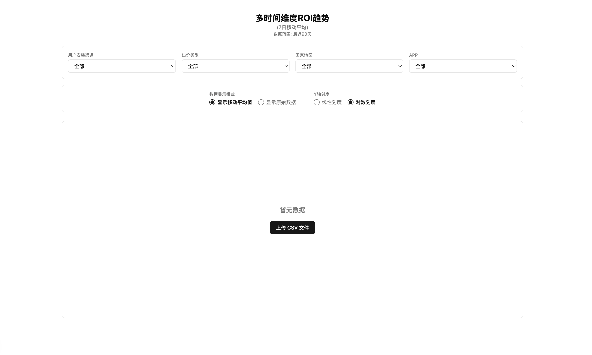
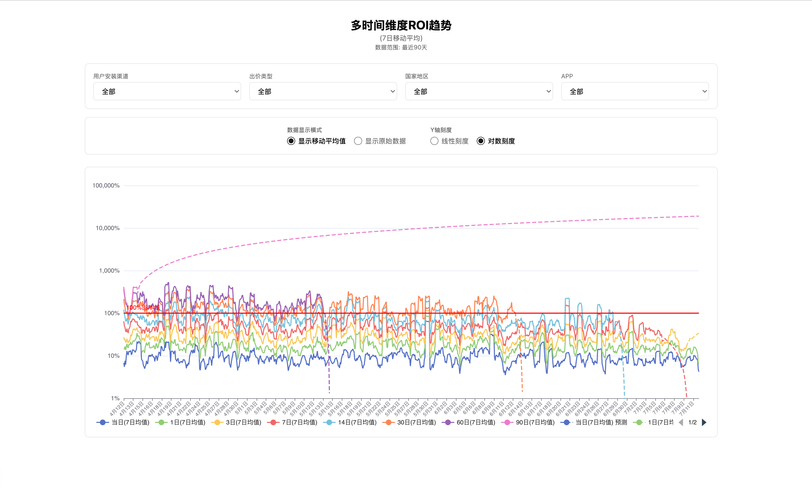

# 使用说明文档 (USER_GUIDE.md)

## 1. 项目功能介绍

App ROI Dashboard 是一个用于分析应用投放回报率（ROI）趋势的数据看板系统，支持从 CSV 导入数据、按多维条件筛选、查看多周期 ROI 曲线以及预测趋势辅助分析。

核心能力如下：

- 多周期 ROI 可视化：支持 D0 / D1 / D3 / D7 / D14 / D30 / D60 / D90
- 数据导入：支持 CSV 上传并自动写入 MySQL
- 多维筛选：支持按安装渠道、出价类型、国家地区、APP 过滤
- 图表交互：支持图例开关、悬停详情、预测虚线、回本参考线
- 显示控制：支持原始值/移动平均、线性/对数坐标切换

## 2. 数据导入操作指南

### 2.1 启动服务

```bash
# 安装依赖
pnpm install

# 初始化环境变量
cp apps/express/.env.example apps/express/.env
cp apps/nextjs/.env.example apps/nextjs/.env

# 构建共享包
pnpm --filter @demo-of-app-roi/shared build

# 启动 MySQL
docker compose up -d

# 启动前后端
pnpm dev
```

常用地址：

- 前端页面：`http://localhost:3000`
- 后端 API：`http://localhost:3001`
- Swagger 文档：`http://localhost:3001/api-docs`

### 2.2 CSV 导入方式

方式一：命令行导入

```bash
curl -X POST http://localhost:3001/api/roi/import \
  -F "file=@example/app_roi_data.csv"
```

方式二：Swagger UI 导入

1. 打开 `http://localhost:3001/api-docs`
2. 找到 `POST /api/roi/import`
3. 点击 `Try it out`
4. 选择 CSV 文件并执行

### 2.3 CSV 格式要求

| 列名 | 说明 | 示例 |
|---|---|---|
| 日期 | `YYYY-MM-DD(星期)` | `2025-04-13(日)` |
| app | 应用名称 | `App-1` |
| 出价类型 | 出价模式 | `CPI` |
| 国家地区 | 国家名称 | `美国` |
| 应用安装.总次数 | 安装数量 | `4849` |
| 当日ROI ~ 90日ROI | 百分比值 | `6.79%` |

### 2.4 清空数据（仅开发环境）

需确保 `apps/express/.env` 中 `NODE_ENV=development`：

```bash
curl -X DELETE http://localhost:3001/api/roi/clear
```

返回示例：

```json
{
  "success": true,
  "data": {
    "deleted_rows": 910,
    "remaining_rows": 0
  },
  "error": null
}
```

## 3. 图表操作指南

图表区域默认展示多周期 ROI 折线，支持以下交互：

- 鼠标悬停：查看当前日期各 ROI 周期具体数值
- 图例点击：显示/隐藏对应曲线
- 预测识别：实线表示实际值，虚线表示线性外推预测值
- 回本判断：红色水平线为 100% ROI 回本参考线

使用建议：

- 先查看整体趋势，再通过图例逐条排查异常周期
- 对波动较大的数据优先使用“移动平均值”观察趋势
- ROI 跨度较大时切换“对数刻度”便于观察低值区间

## 4. 筛选功能使用方法

页面顶部提供四个核心筛选器，从左到右为：

1. 用户安装渠道
2. 出价类型
3. 国家地区
4. APP

使用方式：

- 选择任意筛选项后，图表会自动触发数据刷新
- 选择“全部”可取消该维度筛选
- 可多条件叠加筛选（例如：渠道 + 国家 + APP）

推荐筛选路径：

- 先选 APP（聚焦单产品）
- 再选国家/渠道（定位投放场景）
- 最后切换出价类型（比较投放策略差异）

## 5. 控制器使用说明

控制器位于筛选器下方，分为两个区域：

### 5.1 数据显示模式

- 显示移动平均值：默认 7 日平滑，适合看趋势
- 显示原始数据：保留每日波动，适合看细节

### 5.2 Y 轴刻度

- 线性刻度：适合数据范围接近时对比
- 对数刻度：适合数值跨度大时压缩高值、放大低值

## 6. 界面截图说明（截图位于 `media/`）

### 6.1 空数据状态（首次进入或未导入数据）



说明：

- 页面中央提示“暂无数据”
- 提供“上传 CSV 文件”入口
- 上传后会自动刷新图表数据

### 6.2 已导入数据后的主界面



说明：

- 顶部为筛选器（渠道/出价/国家/APP）
- 中部为控制器（显示模式/Y 轴刻度）
- 下方为 ROI 图表与图例交互区
